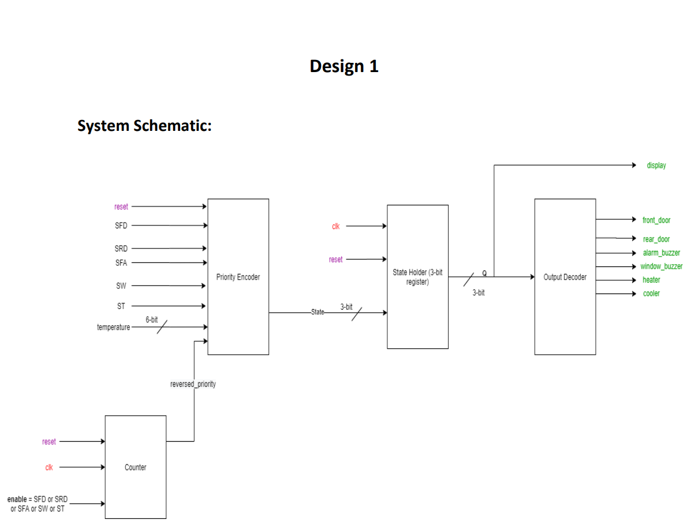
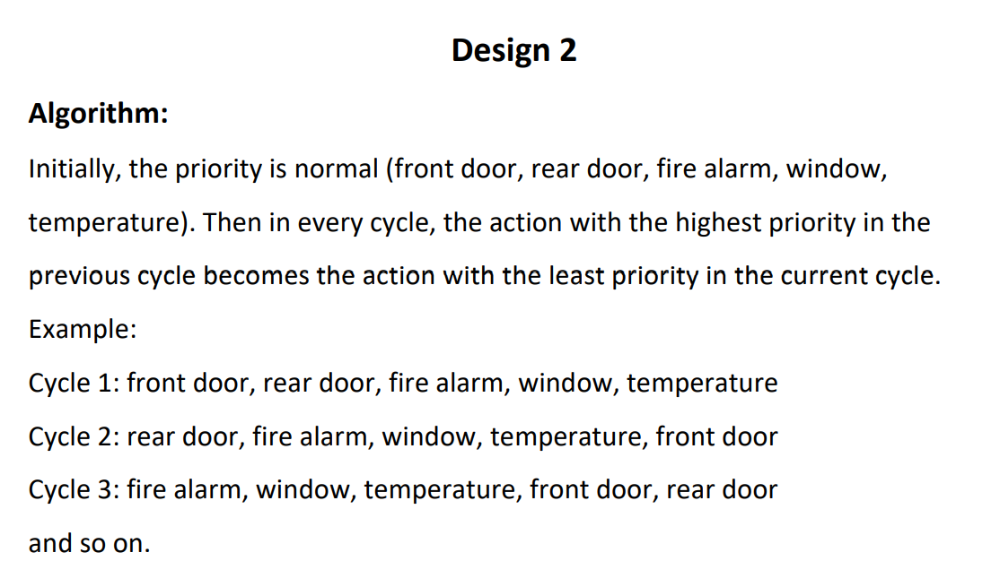

# Home-Automation-System
System Design, RTL implementation using VHDL, logic synthesis using Oasys tool, and physical design (floor planning, power planning, placement, and routing) using Nitro SoC tool of a home automation system.

